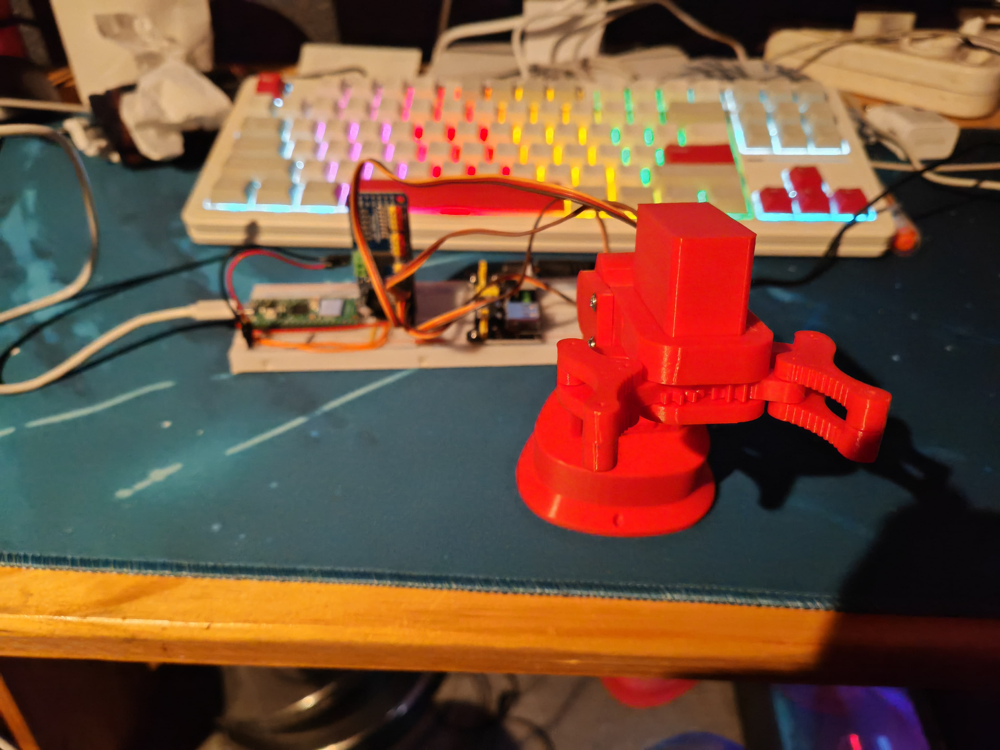
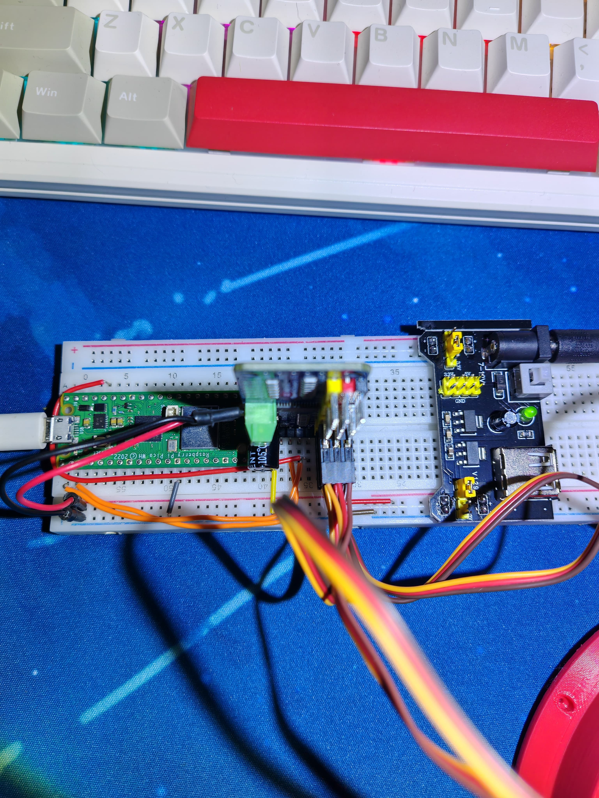

# Pico ARM
This project is a fun demo made to control a robot arm that was 3D printed, is driven by servos and controlled by a raspberry pi pico W.

## Components
All of the parts of the actual robot are 3D printed.
The gripper contains a 180 degree servo that can be given commands to set itself to a precise angle.

The rest of the arm is driven by continuous motion servos that can only be given a speed and a direction.
NOTE: Be very careful when building this for yourself, as these servos can end up getting the arm's wires tangled if you drive the servos past certain boundaries. 

